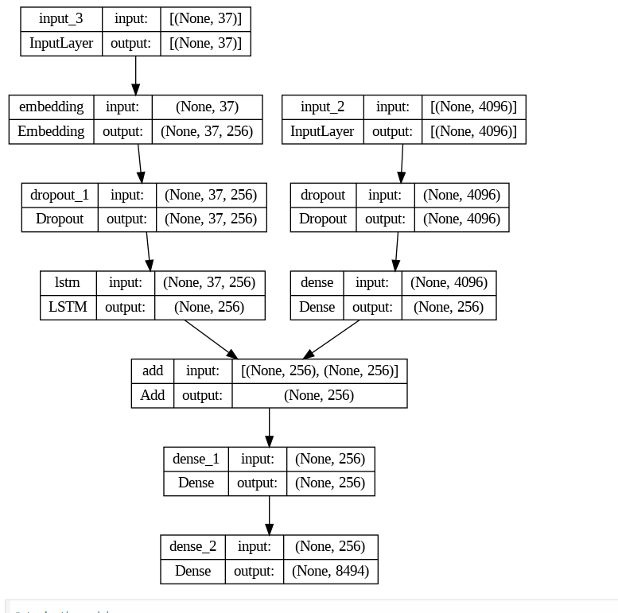
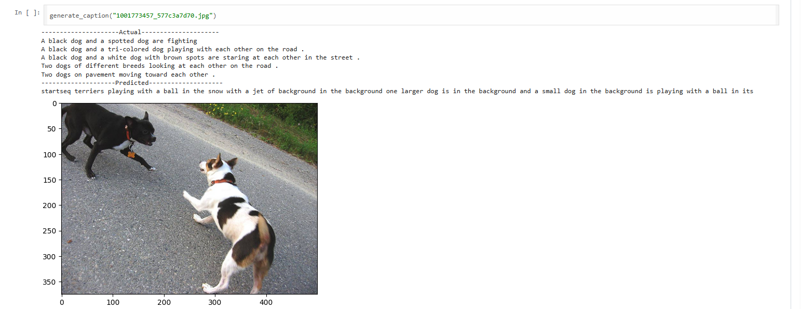

#  Image Caption Generator using Deep Learning


---

## 📖 Project Overview

This project presents an **AI-powered Image Caption Generator** that automatically generates natural language descriptions for images using Deep Learning techniques.

The model combines **Computer Vision** and **Natural Language Processing (NLP)** through an **Encoder–Decoder architecture**. A pre-trained CNN extracts visual features from images, while an LSTM-based decoder generates descriptive captions one word at a time.

This project demonstrates practical applications of Artificial Intelligence in multimodal learning by integrating image understanding with language generation.

---

## 🎯 Objectives

- Automatically generate descriptive captions for images.
- Extract meaningful visual features using a pre-trained CNN.
- Generate grammatically meaningful captions using an LSTM network.
- Demonstrate an end-to-end Deep Learning pipeline for image captioning.

---

# 🏗️ Model Architecture

The architecture consists of two parallel branches:

- **Image Encoder:** Extracts image features using a pre-trained CNN.
- **Caption Decoder:** Learns language representations using an Embedding layer and LSTM.
- Both feature vectors are merged to predict the next word in the caption.

<p align="center">

</p>

---

# 🖼️ Sample Prediction

The example below demonstrates the model generating a caption for an unseen image.

<p align="center">

</p>

---

## ⚙️ Technologies Used

- Python
- TensorFlow
- Keras
- Google Colab
- NumPy
- Pandas
- Matplotlib
- Pillow

---

## 🧠 AI Concepts Applied

- Deep Learning
- Computer Vision
- Natural Language Processing (NLP)
- Convolutional Neural Networks (CNN)
- Long Short-Term Memory (LSTM)
- Transfer Learning
- Feature Extraction
- Sequence Modeling

---

## 📂 Dataset

The project utilizes the **Flickr8k Image Caption Dataset**, consisting of images paired with multiple human-written captions.

> **Note:** The dataset is not included in this repository due to its size and licensing restrictions.

---

## 🚀 Project Workflow

1. Load and preprocess the Flickr8k dataset.
2. Extract image features using a pre-trained CNN.
3. Clean and tokenize image captions.
4. Train the LSTM-based caption generation model.
5. Generate captions for unseen images.

---

## 📁 Repository Structure

```text
Image-Caption-Generator/
│── Project_Image_caption_Generator_fixed.ipynb
│── README.md
│── requirements.txt
│── report on image caption generator (1).pdf
│
└── images/
    ├── model_architecture.png
    └── sample_prediction.png
```

---

## 🎯 Applications

- Image Caption Generation
- Assistive Technology for Visually Impaired Users
- Automatic Image Annotation
- Multimedia Search Systems
- AI-powered Content Generation
- Human–Computer Interaction

---

## 🔮 Future Improvements

- Integrate Attention Mechanisms for improved caption quality.
- Replace the CNN–LSTM architecture with Transformer-based models such as BLIP or ViT-GPT2.
- Evaluate performance using BLEU, METEOR, and CIDEr metrics.
- Deploy the model as a web application using Streamlit or Flask.

---

## 👩‍💻 Author

**Steena Susan Abraham**

Bachelor of Computer Applications (BCA)

This project showcases practical experience in **Artificial Intelligence, Deep Learning, Computer Vision, and Natural Language Processing**.

---

⭐ If you found this project interesting, feel free to explore the code and documentation.
